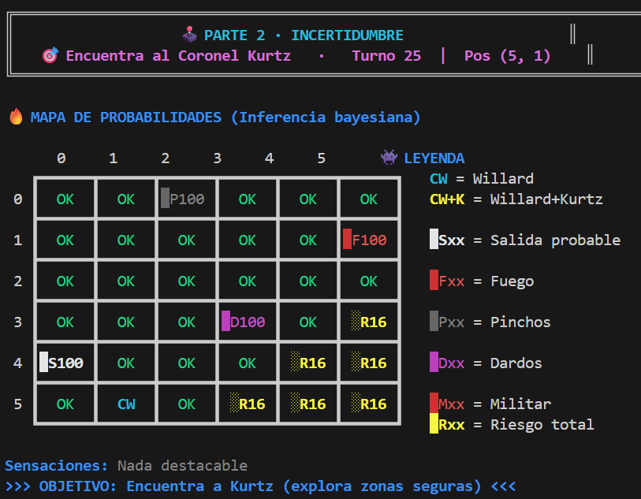
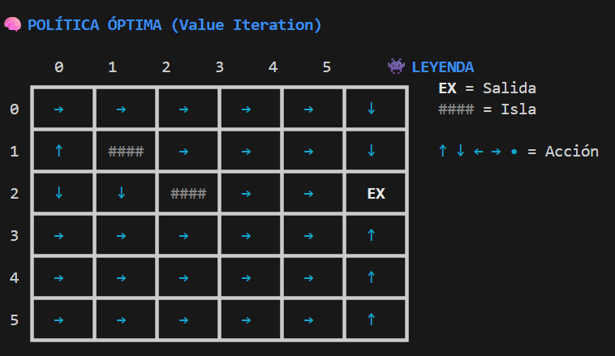

# Buscando al Coronel Kurtz · Agentes de IA en Python

Proyecto de **Fundamentos de Inteligencia Artificial** que explora cómo tomar decisiones con información parcial: deducir qué casillas son seguras, estimar riesgos y planificar movimientos en un entorno estocástico.

**Autor:** Enrique Capella · **Tecnologías:** Python, NumPy · **Técnicas:** razonamiento lógico, BFS, inferencia bayesiana, A* y Value Iteration.

El Capitán Willard debe localizar a Kurtz y escapar de un palacio peligroso. Un tercer escenario plantea el cruce de un río con corrientes e islas. La interfaz de consola muestra el conocimiento y las decisiones de los agentes durante la ejecución.

## Escenarios y algoritmos

| Escenario | Problema | Solución implementada | Visualización |
| --- | --- | --- | --- |
| Palacio lógico | Explorar una cuadrícula 6 × 6 sin conocer la ubicación de los peligros | Base de conocimiento con reglas de deducción y BFS sobre casillas consideradas seguras | Mapa mental con casillas exploradas, peligros posibles y confirmados |
| Palacio bayesiano | Estimar la ubicación de trampas, un enemigo y la salida a partir de estímulos | Actualización de distribuciones con Bayes y A* con penalización por riesgo | Mapa de probabilidades y riesgo |
| Cruce del río | Elegir movimientos cuando la corriente puede cambiar el destino | MDP con transiciones probabilísticas y Value Iteration para extraer una política | Tablero del río y política mediante flechas |

## Vista del proyecto

Capturas de ejecuciones incluidas en la memoria original.

### Palacio bayesiano



### Política del río



## Ejecutar

Necesitas **Python 3.11 o posterior** y una terminal con soporte UTF-8. NumPy es la única dependencia externa.

```bash
git clone https://github.com/enrcap/kurtz-ai-agents.git
cd kurtz-ai-agents
python -m venv .venv
```

Activa el entorno virtual:

```powershell
# Windows PowerShell
.venv\Scripts\Activate.ps1
```

```bash
# macOS / Linux
source .venv/bin/activate
```

Instala la dependencia y abre el menú:

```bash
python -m pip install -r requirements.txt
python -X utf8 kurtz.py
```

En Windows se recomienda Windows Terminal para visualizar los colores y símbolos de la consola. Si PowerShell impide activar el entorno, puedes ejecutar directamente:

```powershell
.venv\Scripts\python.exe -m pip install -r requirements.txt
.venv\Scripts\python.exe -X utf8 kurtz.py
```

### Menú y controles

- **1 → 1:** palacio lógico en modo manual.
- **1 → 2:** palacio lógico con agente automático BFS.
- **2 → 1 → 1/2:** palacio bayesiano en modo manual o automático con A*.
- **2 → 2:** cruce del río; calcula la política y simula su ejecución.
- **0:** salir del menú principal. **Ctrl+C:** interrumpir la ejecución.

En los palacios, `w`, `a`, `s`, `d` permiten moverse al norte, oeste, sur y este. `gw`, `ga`, `gs`, `gd` lanzan la granada en esa dirección y `e` intenta escapar después del rescate. La consola muestra las opciones disponibles en cada turno.

## Organización

```text
kurtz-ai-agents/
├── kurtz.py                 # Menú y punto de entrada
├── palacio_logico.py        # Entorno, base de conocimiento y BFS
├── palacio_bayesiano.py     # Entorno, inferencia bayesiana y A*
├── river_mdp.py             # Modelo del río y Value Iteration
├── utilidades_visuales.py   # Tableros, colores y presentación
├── requirements.txt        # NumPy
└── docs/
    ├── memoria.pdf         # Memoria técnica original
    └── images/             # Capturas de la memoria
```

Cada escenario separa el entorno, el agente o solucionador y el controlador. El entorno mantiene el mapa real; los agentes de los palacios razonan a partir de los perceptos que reciben. Las funciones de presentación se comparten entre los módulos.

## Competencias que demuestra

- Modelado de estados, acciones, perceptos, transiciones y recompensas.
- Implementación de algoritmos de búsqueda con colas y colas de prioridad.
- Actualización de creencias probabilísticas con matrices NumPy.
- Planificación con la ecuación de Bellman y extracción de políticas.
- Diseño modular con clases y visualización de las decisiones del agente.

## Alcance y limitaciones

Es un proyecto académico de simulación. Los mapas se generan aleatoriamente y el resultado varía entre partidas; los agentes de los palacios no tienen garantizado completar cualquier mapa. El agente lógico utiliza reglas específicas del problema, y el agente bayesiano combina los riesgos asumiendo independencia entre amenazas.

El río usa `gamma = 0.9` y `epsilon = 0.001` en la ejecución del menú. La política optimiza el retorno esperado del modelo definido; una trayectoria concreta puede variar por las transiciones aleatorias.

El repositorio no presenta una evaluación estadística de éxito ni una comparación de rendimiento entre agentes. La [memoria técnica](docs/memoria.pdf) describe el modelado, los algoritmos y ejemplos de ejecución. En la memoria se menciona `rio_mdp.py`; el archivo entregado y usado por el programa se llama `river_mdp.py`.

## Contexto académico

Trabajo final de Fundamentos de Inteligencia Artificial, inspirado en *Apocalypse Now*. Esta publicación conserva el código y la memoria entregados y añade documentación para facilitar su revisión y ejecución. La bibliografía y las referencias originales figuran en la memoria.
